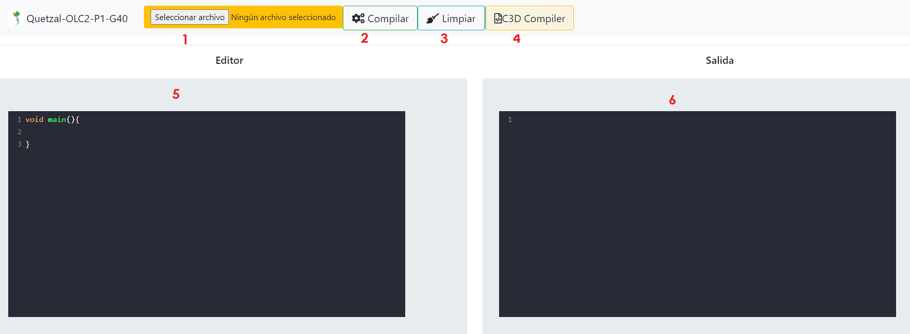
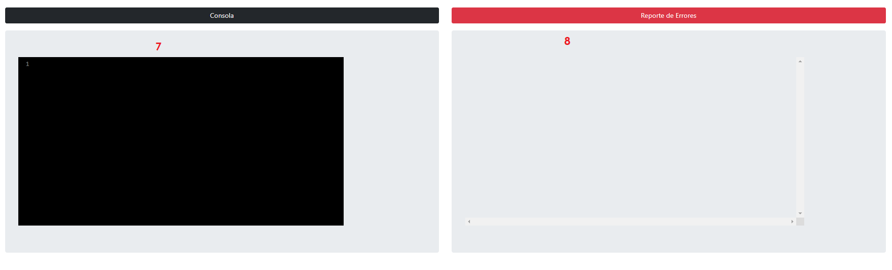
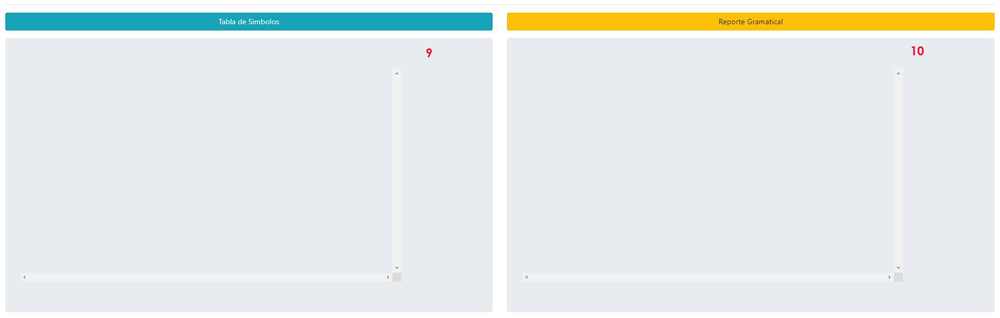
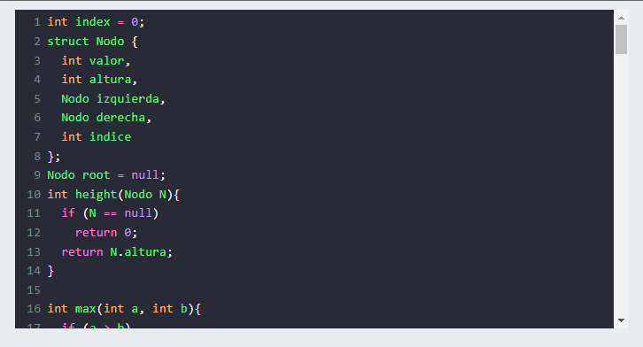
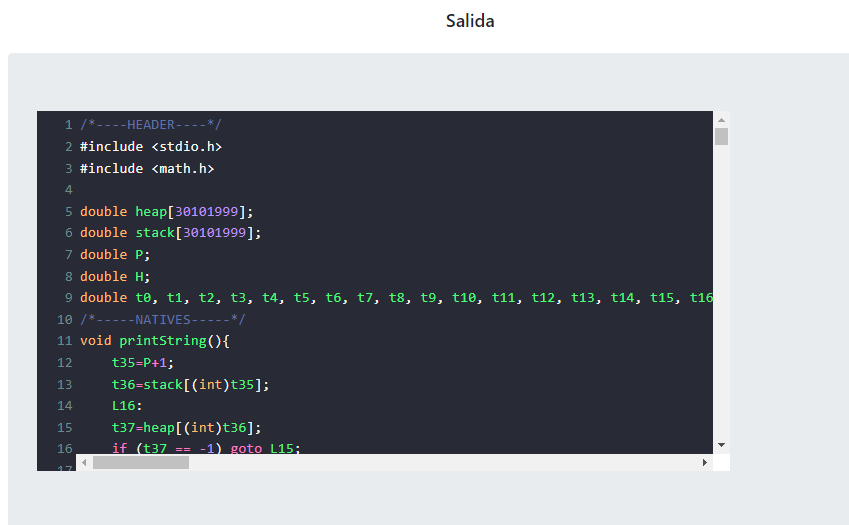
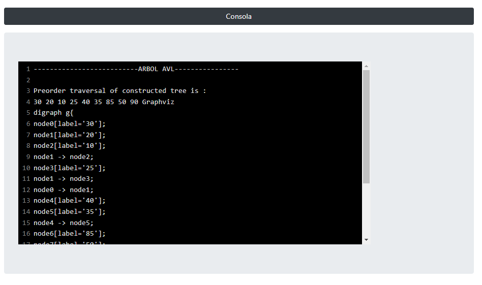
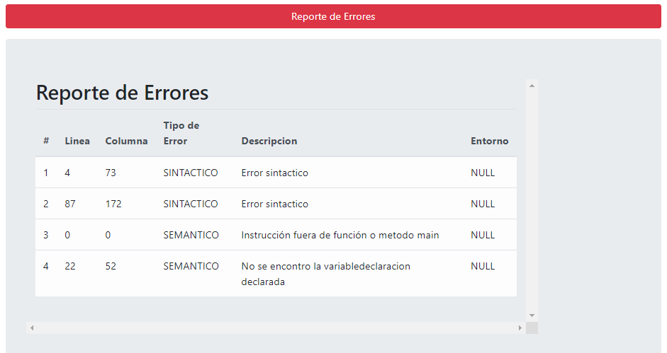
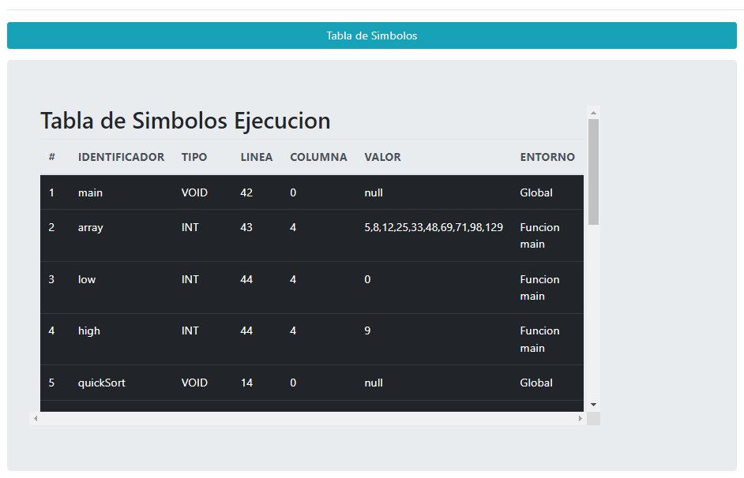
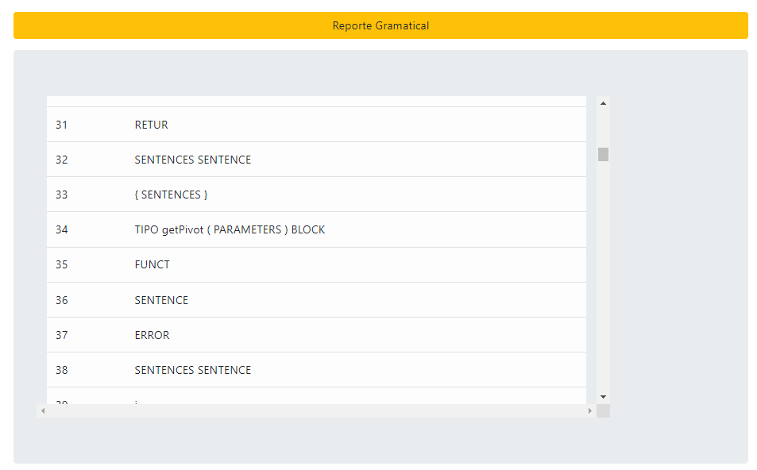
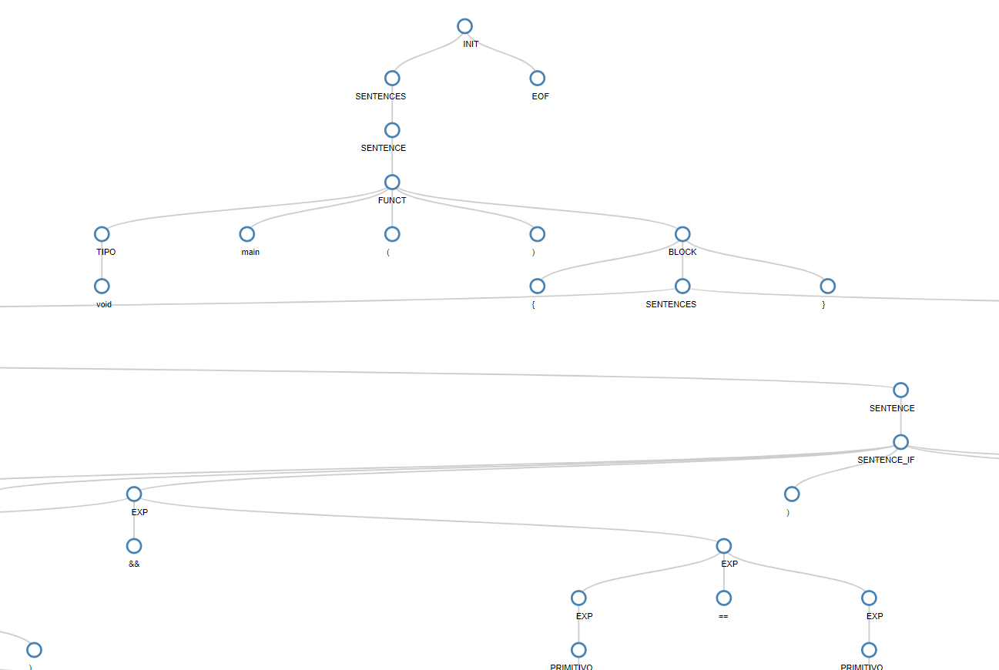

# Manual de Usuario

_Proyecto de Organización de lenguajes y Compiladores 2_

## Quetzal - Proyecto 1🚀
### Grupo #40
## Integrantes💁

| Nombre:                     | Carné     |
| --------------------------- | --------- |
| Jorge David Espina Molina   | 201403632 |
| Josué David Zea Herrera     | 201807159 |

_Quetzal es un lenguaje de programación inspirado en C, su característica principal es la inclusión de tipos implícitos. El sistema de tipos de Quetzal realiza una formalización de los tipos de C y Java. Esto permite a los desarrolladores definir variables y funciones tipadas sin perder la esencia. Otra inclusión importante de Quetzal es la simplificación de los lenguajes C y Java para poder realizar diferentes instrucciones en menos pasos._

_Adicional Quetzal tendrá 2 flujos, se podrá interpretar el código fuente ingresado y efectuar todas sus instrucciones, o bien se puede traducir este lenguaje a un lenguaje intermedio basado en un lenguaje de 3 direcciones, este se podrá ejectuar posteriormente en cualquier compilador de C, tomando en cuenta las reglas especificas de un lenguaje de 3 direcciones_

### Herramientas Utilizadas 📋

- CodeMirror Archivos js.
- HTML: estructura del contenido web
- Java Script: es un lenguaje de programación interpretado, Se define como orientado a objetos, basado en prototipos, imperativo, débilmente tipado y dinámico.
- Windows 10 Home: Sistema operativo
- Jison: Generador de analizadores léxicos y sintácticos.
- GitHub - GithubPage: Para el control de versiones y para publicar la pagina estatica con GithubPage. 
- Chart.js: Librería para la generación del árbol interactivo.
- jsPDF: Generación de tabla de simbolos si se dispara con graficar_ts 
  
### 📋Generación de Archivos de Analizadores
    jison gramatica.jison

## Quetzal 🚀

### 📋 Detalle del Flujo de Quetzal
- 1. Seleccionar un archivo este botón nos abrirá un navegador de windows en el cual podemos buscar el archivo de entrada que deseamos cargar.
- 2. Compilar el Archivo de Entrada previamente cargado para su ejecucion.
- 3. Limpiar nos sirve para limpiar la caja del Editor.
- 4. C3D Compiler hace la traducción para código C3D del archivo de entrada previamente cargado.
- 5. Editor en esta caja de texto se cargara los archivos de entrada que desea cargar o para modificarlos desde Quetzal.
- 6. Salida en esta caja podremos observar la traducción del archivo de entrada a C3D.
- 7. Consola de los resultados de la ejecución.
- 8. Reporte de errores genera una tabla con todos los errores sintácticos,léxicos y semánticos.
- 9. Reporte de Tabla de simbolos.
- 10. Reporte Gramatical se genera un reporte donde se muestra todas las producciones que se van generando.

# 📋 Detalle de cada Seccion

#### Editor al cargar un archivo de Entrada

#### Salida de Codigo C3D 

#### Consola con su Salida respectiva de la ejecución

#### Reporte de Errores 

#### Tabla de Simbolos 

#### Reporte Gramatical 

#### AST 
El arbol siempre se generara despues de la ejecucion haya salido exitosamente.

# Descripcion basica del lenguaje Quetzal
#### Tipos de datos primitivos

| Tipo:                     | token     | Ejemplo | Envío por parametro |
| --------------------------- | --------- | ------ | - |
| Cadena   | String | "Hola mundo" | Valor |
| Caracter     | Char | 'a' | Valor |
| Entero     | int | 5 | Valor |
| Decimal     | double | 1.5 | Valor |
| Booleano     | boolean | true | Valor |
| Arreglo      | [ ]      | [1,2,3] | Referencia |
| Struct      | struct   | Obj(dato:5) | Referencia |

#### Sintaxis del lenguaje

## 📋 Comentarios
    //Este es un  comentario de una linea
    /*Este es
    un comentario
    multilinea*/
### Descripción:
Estos son tramos de código que son obviados por el compilador y que por ende no influyen en la ejecución final del programa.

## 📋 Print y Println
    println("Hola mundo");
    print("OLC2");
### Descripción:
Esta función nativa de Quetzal permite escribir en consola el resultado de ejecutar una expresion, si se usa println se escribirá un salto de linea al final de la instrucción

## 📋 Declaraciones y asignaciones
    int variable = 10;
    variable = 15;
    String variable2, variable3, variable4;
    variable4 = "Hola";
### Descripción:
Creación y asignación de variables, se les asigna un tipo de dato el cual no cambia durante la ejecución.

## 📋 Condicional if
    if ( a==b ) {
        println("Instrucciones");
    }
    if ( false )
        println("Instrucciones");
    if ( a==b && 5<4 ) {
        println("Instrucciones");
    } else if ( !true ) {
        println("Instrucciones");
    } else {
        println("Instrucciones");
    }

### Descripción:
Sentencia de control que ejecuta ciertas instrucciones deppendiendo la resolución de una condición en específico.
  
  
  ## 📋 Condicional switch
    int day = 4;
    switch (day) {
    case 1:
        println("Monday");
      break;
    case 2:
        println("Tuesday");
        break;
    case 3:
        println("Wednesday");
        break;
    }
- ### Descripción:
  Sentencia de control que ejecuta ciertas instrucciones deppendiendo el valor que se le envie.
  
## 📋 Operador ternario
    respuesta = edad >= 50 ? "Puede vacunarse" : "No puede vacunarse";
    println(animal == "Perro" ? 15 : 10);
### Descripción:
Sentencia de control que ejecuta ciertas instrucciones deppendiendo la ejecucióno de una condición.

## 📋 Bucle while
    int i = 0;
    while (i < 5) {
        println(i);
        i++;
    }
### Descripción:
Bucle que ejecuta las instrucciones si una condición específica se cumple.

## 📋 Bucle do-while
    int i = 0;
    do {
        println(i);
        i++;
    }while (i < 5);
### Descripción:
Bucle que ejecuta las instrucciones, evalua si la condición se cumple, si la condición se cumple repite las instrucciones.
## 📋 Bucle for
    for (int i = 0; i < 5; i++) {
        println(i);
    }
    for letra in "Hola Mundo!"{
            print(letra, "-");
    }
    String cadena = "OLC2";
    for letra in cadena{
        print(letra, "-");
    }
    for animal in ["perro", "gato", "tortuga"]{
        println("$animal es mi favorito");
    }
   
### Descripción:
Bucle que ejecuta las instrucciones dependiendo la variable que se le asigne, si posee condición se evalúa y si no se recorre la variable ingresada.
## 📋 Funciones
    int sumar(int num1, double num2){
        return num1 + toInt(num2);
    }
    void Agregar(int[] arr, boolean prueba){
        println("Instrucciones");
    }
### Descripción:
Es una serie de instrucciones que se ejecuta en cuando el programador desee, se le asigna un nombre, un tipo de dato a retornar y una lista de parametros que se le debe enviar.
## 📋 Funciones nativas
    println(log10(100));            // Logaritmo de base 10
    println(sin(134));              // Seno del angulo
    println(cos(var1));             // Coseno del angulo
    println(tan(12));               // Tangente del angulo
    println(sqrt(16));              // Raiz cuadrada
    println(pow(2,4));              // Potencia
    println(toInt("15"));           // Casteo a entero
    println(toDouble("1.5152"));    // Casteo a decimal
    println(string(1.5));           // Casteo a cadena
    println(typeof(1.5));           // Saber el tipo de dato del objeto
### Descripción:
Son funciones que retornan un tipo de dato, mismo que corresponde a la operación que sea realizar, existen operaciones trigonometricas y matemáticas.
#### Nota
Para las funciones trigonométricas, seno, coseno y tangente, el parámetro que se les envía debe estar en grados.

## 📋 Métodos nativos
    println(int.parse("8200"));             // Parseo a entero
    println(double.parse("3.13159"));       // Parseo a decimal
    println(boolean.parse("1"));            // Parseo a booleano
    println(arreglo.length());              // Tamaño del arreglo o cadena
    println(animal.toUppercase());          // Mayúsculas a cadena
    println(animal.toLowercase());          // Minúsculas a cadena
    println(animal.subString(2,4));         // Substraer una cadena de otra
    println(animal.caracterOfPosition(2));  // Letra en la posisción enviada
### Descripción:
Son métodos propios de algún tipo de objeto, estos permiten obtener cierta información o realizar alguna acción dependiendo lo solicitado.

## 📋 Llamada a funciones
    ordenamiento(arr1,arr2);
    imprimirLista(lista);
    nuevaLinea();
### Descripción:
Es una sentencia que invoca a una función previamente guardada para ejecutar las acciones que éste contenga, puede o no contener una lista de parámetros.

## 📋 Arreglos
    int[] arr = [1,2,3,4,5,6];
    boolean[] arr2 = [true, false, true, true];
    String[] arr = ["H","O","L","A"];
    print(arr[1]);                          // Acceso a la posición 1 del arreglo
    print(arr[2:4]);                        // Acceso al rango de posiciones 2,4
    int[] arr2 = #arr;                      // Copia exacta de un arreglo
### Descripción:
Es una lista que contiene varios elementos de un mismo tipo de dato.

## 📋 Métodos nativos y operaciones de arreglos
    int[] arr = [1,2,3,4,5,6];
    arr.push(7);               // Se agrega el elemento al final del arreglo
    arr.pop();                 // Se elimina el elemento que se encuentre al final
    print(arr#*2);             // Se multiplican x2 todos los elementos del arreglo
### Descripción:
Es una lista que contiene varios elementos de un mismo tipo de dato.

## 📋 Structs
    struct Estructura{
        int x
    };
    struct Persona{
        String nombre,
        int edad,
        Persona padre
    };
    Estructura strct = Estructura(0);
    Persona persona1 = Persona("Tony", 25, null);
    println(persona1.nombre);
### Descripción:
Es una estructura que contiene en su interior una lista de variables, mismas que pueden ser cada una de cualquier tipo de dato que contenga Quetzal.
